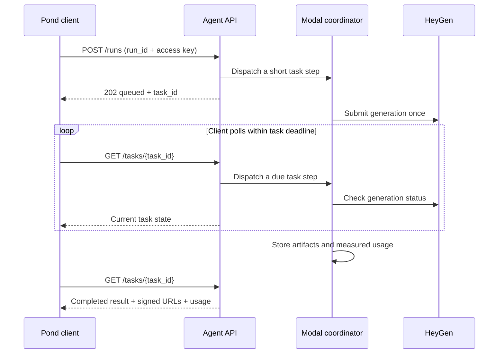

# Pond HeyGen Agent

A [Pond Protocol](https://docs.joinpond.ai/update/docs/build-and-publish-an-agent-on-pond)
example from **Pond-International** that turns HeyGen's video APIs into an
asynchronous agent. It demonstrates manifest discovery, authenticated requests,
idempotent task submission, polling, signed artifact delivery, and usage reporting.

HeyGen renders the videos. [Modal](https://modal.com/docs/guide) hosts the Python
HTTP API, task coordinator, and artifact storage using CPU workers that scale to
zero. Deploy this example with your own HeyGen and Modal accounts.

## What it supports

The manifest advertises **109 actions**: 107 native HeyGen/wrapper actions and two
convenience actions:

| Action | Input | Result |
| --- | --- | --- |
| `generate_video` | A creative brief, with optional reference files | An MP4 planned and rendered by HeyGen |
| `generate_presenter_video` | A final script and an avatar or permitted portrait | An MP4 preserving the supplied script |

Both convenience actions accept **5–60 seconds**, defaulting to 30 seconds.
This is the example agent's policy; upstream limits vary by HeyGen endpoint.
Native actions cover video creation, translation, lipsync, templates, clips,
assets, finite batches, and video-producing workflows. Account and webhook
administration are excluded from the public manifest.

Read the [action and pricing policy](docs/action-policy.md) for render restrictions,
media limits, and disabled non-video generation actions. The
[coverage inventory](docs/heygen-coverage.md) maps the pinned HeyGen contract to
implemented actions. Some provider features require account access; implementation
and schema coverage do not establish live availability.

## Quick start

You need Python 3.12 or later, [uv](https://docs.astral.sh/uv/), a Modal account,
and a HeyGen API key with access to the actions you intend to use.

```sh
git clone https://github.com/Pond-International/pond-heygen-agent.git
cd pond-heygen-agent
uv sync --python 3.12
uv run modal setup
cp .env.example .env
chmod 600 .env
```

Set `HEYGEN_API_KEY` in your local `.env`, then deploy:

```sh
uv run python -m pond_heygen_agent.operator setup
uv run modal deploy -m pond_heygen_agent.modal_app
```

Setup generates separate Pond access and artifact signing keys, protects `.env`
with mode `0600`, and updates the dedicated Modal secret. Keep those keys stable
across redeployments. Copy the HTTPS base URL printed by Modal:

```sh
export AGENT_BASE_URL='https://YOUR-WORKSPACE--pond-heygen-agent-web.modal.run'
uv run python -m pond_heygen_agent.operator configure --base-url "$AGENT_BASE_URL"
curl --fail --silent --show-error "$AGENT_BASE_URL/health"
```

The initial `configure` step makes read-only HeyGen calls to verify credentials
and discover avatar/voice presets. Check for `generation_ready: true`.
[Deployment and operations](docs/deployment.md) covers unconfigured deployments,
custom presets, updates, cleanup, and recovery. Configuration success does not
submit a paid video or verify every provider action.

## Connect to Pond

Register the deployed HTTPS **base URL** in Pond and set its Access Key to the
`POND_AGENT_ACCESS_KEY` generated in `.env`. Pond discovers the actions through
`GET /manifest`. Keep the HeyGen API key in the backend's Modal secret.

The example advertises **$0.13 per completed video-second**. Review and save the
pricing plan in Pond before accepting paid requests. Usage sums the actual
durations of distinct completed videos and rounds up once; a 9.7-second output
reports 10 units. Requested duration is not a billing cap. See
[metering and price configuration](docs/action-policy.md#video-second-metering).

Follow the [Pond agent publishing guide](https://docs.joinpond.ai/update/docs/build-and-publish-an-agent-on-pond)
for listing setup.

## Make a protocol request

This implementation uses `marketplace-agent` protocol version `1.0`.

| Endpoint | Access | Purpose |
| --- | --- | --- |
| `GET /manifest` | Public | Action schemas, examples, capabilities, and pricing |
| `GET /health` | Public | Configuration readiness without calling HeyGen |
| `POST /runs` | Bearer key + protocol headers | Validate and submit an idempotent run |
| `GET /tasks/{task_id}` | Bearer key + protocol version | Poll a task and advance collection |
| `GET` / `HEAD /artifacts/{artifact_id}` | Signed URL | Download an output until its expiry |

[examples/generate-video.json](examples/generate-video.json) contains a complete
request envelope. For a read-only native action, use
[examples/list-voices.json](examples/list-voices.json). The
[protocol walkthrough](docs/protocol.md) shows submission, polling, retries,
output negotiation, and errors.

The generation example spends HeyGen credits when submitted to a configured
deployment.

## How it works



The API and coordinator use a Modal Dict for durable state and a Volume for
artifacts. A single writer controls provider submission, with at most two active
provider slots. There is no worker waiting throughout a render, recurring cron,
or webhook dependency. Client polling drives status collection at intervals of
at least 20 seconds per task. Runs allow up to 30 minutes.

Artifacts and signed links are retained for seven days. Cleanup runs on activity;
physical deletion can occur after expiry. A signed URL grants download access to
anyone holding it. HeyGen account retention is separate from this agent's storage.

Timeout does not cancel an upstream render or reverse provider charges. Ambiguous
submissions are never automatically regenerated. See the
[recovery procedure](docs/deployment.md#recover-an-uncertain-submission) before
retrying an uncertain job under a new run ID.

## Development

```sh
uv sync --python 3.12
uv run ruff check .
uv run ruff format --check .
uv build
```

These checks do not call HeyGen. Modal images include `ffmpeg` for measuring
video duration. Source and wheel builds explicitly select public files, excluding
local secrets, run ledgers, caches, and worktrees.

| Location | Responsibility |
| --- | --- |
| `src/pond_heygen_agent/protocol.py`, `api.py` | Pond manifest, validation, and HTTP interface |
| `store.py`, `service.py`, `tool_service.py` | Durable task state and execution |
| `tool_registry.py`, `data/heygen-v3.json` | Pinned HeyGen contract and action schemas |
| `provider.py`, `tool_runtime.py`, `tool_jobs.py` | Provider requests and completion handling |
| `media.py`, `media_files.py`, `artifacts.py` | Validated transfers and signed delivery |
| `video_usage.py`, `duration_probe.py` | Actual output metering |
| `modal_app.py`, `operator.py` | Deployment and operator commands |

See [registry internals](docs/toolset-coverage.md) for schema compilation and
completion semantics.

## License

[MIT](LICENSE), copyright 2026 Pond-International. HeyGen and Modal services
remain subject to their own terms. The bundled HeyGen OpenAPI snapshot is
attributed in the [coverage inventory](docs/heygen-coverage.md).
