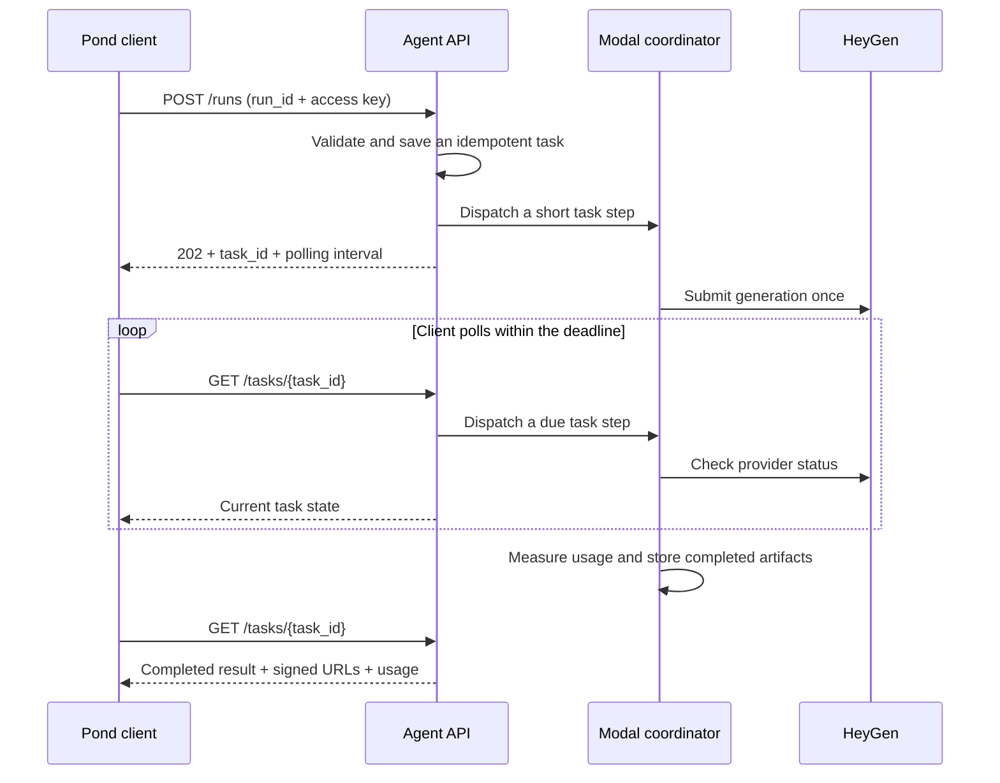

# Code walkthrough

Start with the [welcome-video request](../examples/generate-video.json) and trace
it through the files below. This path shows the Pond integration using the two
convenience actions. The native HeyGen actions share the HTTP interface and task
store, with separate provider execution and completion handling.

## Follow a request

1. **Advertise and validate the contract.**
   [protocol.py](../src/pond_heygen_agent/protocol.py) defines the request envelope,
   `BriefParameters`, and `PresenterParameters`. `manifest()` advertises actions,
   input schemas, capabilities, and pricing. `normalize()` validates requests and
   supplies defaults before a task is accepted. Native parameters are delegated
   to the compiled registry.

2. **Accept an authenticated run.**
   [api.py](../src/pond_heygen_agent/api.py), through `create_api()`, exposes public
   `/manifest` and `/health`, protected `/runs` and `/tasks/{task_id}`, and signed
   artifact downloads. `POST /runs` checks the access key, protocol version, body,
   and matching idempotency header before dispatching work.

3. **Persist identity and progress.**
   [store.py](../src/pond_heygen_agent/store.py) implements `TaskStore`. It derives
   a task ID from `run_id` and fingerprints the normalized request. A matching
   retry returns the existing task; a changed request conflicts. Terminal output
   and usage are saved for later retries. Slot claims and submission markers
   survive worker restarts.

4. **Run a short coordinator step.**
   [modal_app.py](../src/pond_heygen_agent/modal_app.py) connects the API to the
   Modal Dict, Volume, secrets, and `Coordinator`. The coordinator selects
   `TaskService` for the two convenience actions and `NativeTaskService` for
   native actions. It runs with one container and one input at a time, keeping
   lifecycle and provider-slot decisions serialized.

5. **Submit to HeyGen and collect completion.**
   [service.py](../src/pond_heygen_agent/service.py) implements `TaskService.step()`.
   A task without a saved provider job reserves capacity and claims submission;
   one with a job checks its status when due. For convenience actions,
   [provider.py](../src/pond_heygen_agent/provider.py) implements `HeyGenClient`:
   `create()` translates a brief into a Video Agent request or a script into an
   avatar/image video request, while `status()` checks the resulting job.

6. **Measure and deliver the result.**
   [video_usage.py](../src/pond_heygen_agent/video_usage.py) sums distinct completed
   video durations and rounds up once. [duration_probe.py](../src/pond_heygen_agent/duration_probe.py)
   uses a bounded local ffprobe when provider duration is unavailable. Artifact
   callbacks in `modal_app.py` validate and save files to the Volume.
   [artifacts.py](../src/pond_heygen_agent/artifacts.py) signs their URLs; the API
   verifies those signatures before serving files. The service finishes the task
   with its output, artifacts, and measured usage.

## How native actions fit in

The full toolset is compiled offline from a pinned HeyGen OpenAPI snapshot.
Manifest discovery performs no provider requests.

| File | Responsibility |
| --- | --- |
| [tool_registry.py](../src/pond_heygen_agent/tool_registry.py) | Compile operations, classify public access, build action schemas, and validate native parameters |
| [manifest_schema.py](../src/pond_heygen_agent/manifest_schema.py) | Adapt JSON Schema presentation to Pond discovery requirements |
| [tool_guides.py](../src/pond_heygen_agent/tool_guides.py) | Provide action-specific descriptions and input examples |
| [tool_service.py](../src/pond_heygen_agent/tool_service.py) | Apply the task lifecycle to native actions and save their results |
| [tool_jobs.py](../src/pond_heygen_agent/tool_jobs.py) | Track provider completion, child jobs, batches, and output files |
| [tool_runtime.py](../src/pond_heygen_agent/tool_runtime.py) | Execute validated provider operations and uploads with resource access checks |
| [resource_access.py](../src/pond_heygen_agent/resource_access.py) | Scope private resources to `(agent_id, user.id)` and enforce explicit sharing |
| [data/heygen-v3.json](../src/pond_heygen_agent/data/heygen-v3.json) | Preserve the pinned upstream contract used by the registry |

Read [registry internals](toolset-coverage.md) for schema compilation and
completion families. The [coverage inventory](heygen-coverage.md) identifies
which operations are enabled, disabled, or reserved for operators.

## Where to customize

| Change | Start here | Keep aligned |
| --- | --- | --- |
| Agent name, description, or advertised capabilities | `manifest()` in [protocol.py](../src/pond_heygen_agent/protocol.py) | Metadata and the behavior actually exposed by the API |
| Convenience-action inputs or defaults | Parameter models in [protocol.py](../src/pond_heygen_agent/protocol.py) | Manifest examples, validation, and request translation in [provider.py](../src/pond_heygen_agent/provider.py) |
| Native action guidance | [tool_guides.py](../src/pond_heygen_agent/tool_guides.py) | Registry schemas and schema-valid examples |
| Explicit render restrictions | [render_policy.py](../src/pond_heygen_agent/render_policy.py) | Advertised schemas, runtime validation, and the [action policy](action-policy.md) |
| Non-video action availability | [nonvideo_policy.py](../src/pond_heygen_agent/nonvideo_policy.py) | Metering coverage and a suitable pricing model before enabling paid work |
| Per-second price | `PRICING_PLAN` in [video_usage.py](../src/pond_heygen_agent/video_usage.py) | Pricing text in protocol/tool guides, documentation, and the saved Pond listing |
| Verified presets and shared assets | [operator.py](../src/pond_heygen_agent/operator.py) and deployment configuration | Which resources callers can discover and use; see [sharing settings](deployment.md#presets-and-shared-resources) |
| Deployment names and compute | [modal_app.py](../src/pond_heygen_agent/modal_app.py) and [operator.py](../src/pond_heygen_agent/operator.py) | App, Dict, Volume, and secret names |

For another provider, begin with the convenience path: its main provider boundary
is `HeyGenClient.create()` / `status()`, called by `TaskService`. The native registry,
schemas, and completion handlers are HeyGen-specific and also need replacement
if the new agent exposes native tools. Describe only implemented actions and
capabilities in the new manifest.

## Operating boundaries

Client polling drives task progress in short steps, with provider checks at most
once per task every 20 seconds. No worker sleeps throughout a render, and there
is no recurring cron or webhook dependency. Runs permit up to 30 minutes and at
most two provider slots are active. Stopping polling can leave a finished provider
job uncollected until polling resumes within its deadline.

A durable submission marker prevents automatic regeneration after an ambiguous
submission. Timeout and failure do not guarantee upstream cancellation or a
refund. See [operator recovery](deployment.md#recover-an-uncertain-submission).

[media.py](../src/pond_heygen_agent/media.py) and
[media_files.py](../src/pond_heygen_agent/media_files.py) enforce public-network
fetching, transfer bounds, and media validation. Keep those checks when extending
provider support. Artifacts and signed links have seven-day retention; physical
cleanup is opportunistic. HeyGen account storage follows its own retention rules.

The shared Pond access key authenticates a trusted caller. That caller supplies
the identities used for resource ownership; an end-user application needs its own
authentication boundary before invoking this backend. Signed artifact links grant
access independently until expiry.
